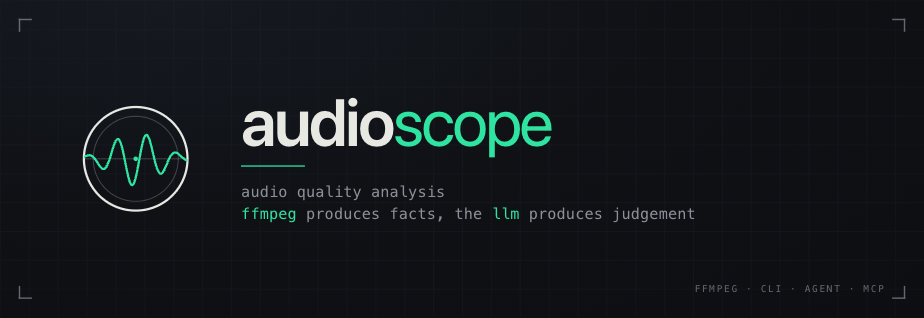
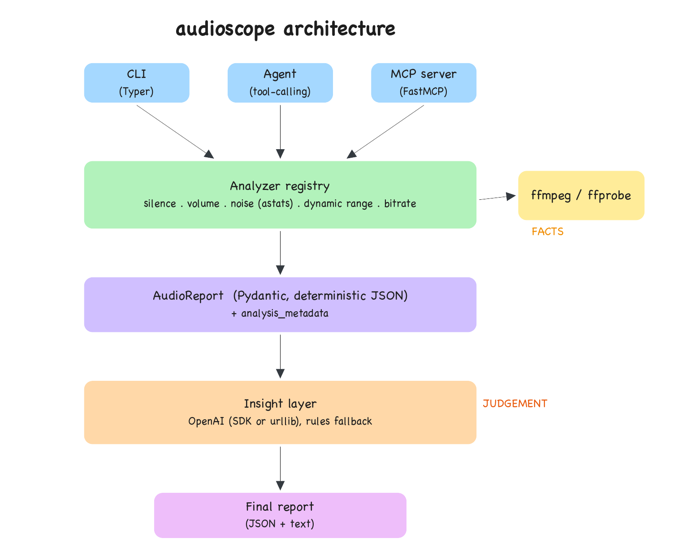

<p align="center">
  
</p>

# audioscope

`audioscope` analyzes audio files with `ffmpeg`/`ffprobe`, produces a structured JSON
quality report, and uses an LLM to turn those measurements into readable insight and
concrete recommendations. It works on any audio (recordings, podcasts, voice memos, call
captures, and more).

## Design idea: facts vs. judgement

The core principle is a clean split between measurement and interpretation:

> ffmpeg produces facts. The LLM produces judgement. The two stay separate.

The measurement layer (probe plus detectors) computes objective numbers such as duration,
bitrate, silence ratio, volume, and clipping, then emits a deterministic, schema-validated
JSON report. Run it twice and you get the same output, with no LLM involved.

The insight layer reads that report and interprets it: what do these numbers mean, and what
should someone do about them? The LLM never measures audio and never invents numbers. It
reasons only over the evidence already computed.

The payoff is that reports are reproducible and auditable, the LLM's output can always be
checked against the numbers, and the whole thing degrades gracefully to a rule-based summary
when no API key is present.

## Architecture

<p align="center">
  
</p>

The CLI pipeline, the tool-calling agent, and the MCP server all run the same analyzer
registry, so a new check is a one-class change that every entry point picks up at once.

### Analyzer registry

Each analyzer receives an `AnalysisContext` plus the metrics emitted by earlier analyzers,
and returns new metrics and typed `Issue`s. To add a check, implement one class and add it
to `DEFAULT_ANALYZERS`; no pipeline or schema edits are needed.

| Analyzer | Emits |
|----------|-------|
| `SilenceAnalyzer` | `silencedetect` segments, silence ratio, long-silence/high-ratio issues |
| `VolumeAnalyzer` | mean/peak volume, graded clipping confidence, low-volume issue |
| `NoiseAnalyzer` | `astats` RMS and noise floor (skipped on very long files), elevated-noise issue |
| `DynamicRangeAnalyzer` | derived `peak_to_mean_db` (no extra ffmpeg pass) |
| `BitrateAnalyzer` | low-bitrate issue |

Unknown metrics flow into `audio_quality.extra_metrics`, so experimental analyzers need no
schema change. Every report records `analysis_metadata` (mode, analyzer list, effective
config) for reproducibility.

### Module map

| Module | Responsibility |
|--------|----------------|
| `ffmpeg.py` | Safe `subprocess` wrappers around `ffmpeg`/`ffprobe` (timeouts, errors) |
| `probe.py` | Metadata via `ffprobe -print_format json` (no regex over logs) |
| `analysis/silence.py` | `silencedetect` parsing, segment merging, ratio |
| `analysis/volume.py` | `volumedetect` mean/peak parsing |
| `analysis/clipping.py` | Graded clipping heuristic from peak and 0 dBFS sample count |
| `analysis/noise.py` | `astats` RMS and noise-floor parsing (non-finite maps to `null`) |
| `analyzers.py` | Analyzer registry (`AnalysisContext`, `AnalyzerOutput`, defaults) |
| `config.py` | Typed thresholds plus JSON `--config` loading and serialization |
| `models.py` | Pydantic schemas, the contract between layers |
| `pipeline.py` | Runs the registry, composes the validated `AudioReport` |
| `insight/llm.py` | Provider-agnostic client: OpenAI SDK then pure-urllib fallback |
| `insight/direct.py` | LLM interpretation plus deterministic rule fallback |
| `insight/agent.py` | Tool-calling agent driver |
| `tools.py` | Shared analysis tools for the agent and MCP server |
| `mcp_server.py` | FastMCP server exposing the tools |
| `batch.py` | Concurrent multi-file processing and aggregation |
| `cli.py` | Typer entry point |

## Installation

Requires Python 3.11+ and `ffmpeg` on `PATH` (`brew install ffmpeg`).

```bash
cd audioscope
python -m venv .venv
source .venv/bin/activate
pip install -e ".[dev]"
```

### Audio files

Audio is not bundled with this repo. Drop your own recordings into [`data/`](data/), which is
git-ignored, or pass any path on the command line. See [`examples/`](examples/) for sample
reports the tool produced.

### Configuring the LLM (optional)

The LLM layer uses OpenAI. Provide a key via a `.env` file (see `.env.example`):

```bash
export OPENAI_API_KEY=sk-...
```

Without a key, `audioscope` still runs and produces a deterministic rule-based summary
instead of an LLM one. The client tries the OpenAI SDK first (strict `json_schema`), then
falls back to a pure-`urllib` transport so insight still works where no SDK can be installed,
and finally to rules if neither is reachable.

## Usage

```bash
# Single file, human-readable report
audioscope analyze data/sample_001.wav

# Structured JSON
audioscope analyze data/sample_001.wav --json

# Whole directory (batch) with an aggregate summary
audioscope analyze data/ --json -o report.json

# Skip the LLM (deterministic, offline)
audioscope analyze data/sample_001.wav --no-llm

# Drive analysis with the tool-calling agent
audioscope analyze data/sample_001.wav --agent

# Tune detection thresholds without code changes
audioscope analyze data/sample_001.wav --config examples/strict_config.json
```

### Output schema

```json
{
  "file_name": "sample_001.wav",
  "duration_seconds": 121.1,
  "metadata": { "bitrate_bps": 47235, "sample_rate_hz": 16000, "channels": 1, "codec": "mp3" },
  "audio_quality": {
    "silence_ratio": 0.32,
    "clipping_detected": true,
    "clipping_confidence": "high",
    "avg_volume_db": -16.6,
    "max_volume_db": -0.4,
    "rms_level_db": -16.6,
    "noise_floor_db": null,
    "silence_segments": [ { "start_seconds": 32.4, "end_seconds": 43.4 } ],
    "extra_metrics": { "peak_to_mean_db": 16.2 }
  },
  "issues": [
    { "type": "clipping", "severity": "critical", "message": "Possible clipping/distortion (high confidence: ...)" }
  ],
  "insight": {
    "summary": "...",
    "recommended_actions": ["..."],
    "usable_as_is": false,
    "generated_by": "llm:gpt-4o-mini"
  },
  "analysis_metadata": {
    "mode": "deterministic",
    "analyzers": ["silence", "volume", "noise", "dynamic_range", "bitrate"],
    "config": { "silence_noise_db": -30.0, "...": "..." }
  },
  "analysis_version": "1.0.0"
}
```

A `null` `noise_floor_db` means `astats` reported a non-finite floor (common on clean or
near-silent tracks). The report surfaces that honestly rather than inventing a number.

The measurement fields are deterministic; only the `insight` block varies between model
runs. Use `--no-llm` for a fully deterministic, offline rule-based summary.

## Features

### Agentic analysis (`--agent`)

`insight/agent.py` gives the LLM the analysis tools (metadata, silence, volume, clipping,
noise) and lets it decide which to call. The agent's exploration drives the analysis, but the
final report is still assembled by the registry, so the output contract holds regardless of
the path the agent takes. With no LLM configured it falls back to the deterministic pipeline.

### MCP server (FastMCP)

Expose the ffmpeg tools to any MCP client (for example Claude Desktop):

```bash
python -m audioscope.mcp_server
```

Tools: `get_metadata`, `detect_silence`, `detect_clipping`, `measure_volume`,
`estimate_noise`, `analyze_audio`.

### Batch processing

Pointing `analyze` at a directory processes all audio files concurrently and produces a
`BatchReport` with per-file reports, issue counts, average duration, average silence ratio,
lists of clipping and low-volume files, top issues, and an aggregate summary.

### Configurable thresholds (`--config`)

Every threshold in `config.py` can be overridden from JSON, so behaviour is tunable as data
with no code change. See [`examples/strict_config.json`](examples/strict_config.json). The
effective config used for a run is recorded in each report's `analysis_metadata`.

## Notes on design decisions

- Shelling out to ffmpeg (rather than a Python audio library) reuses ffmpeg's well-tested
  analysis filters. Metadata is parsed from `ffprobe` JSON, and filter output is parsed by
  anchoring on stable tokens, which is unit-tested.
- Clipping is a graded heuristic. Peak proximity to 0 dBFS and the count of samples pinned at
  0 dBFS map to low/medium/high confidence, which in turn maps to issue severity. True
  sample-peak clipping needs decoded-PCM inspection; the `astats` `Flat factor` would be a
  stronger follow-up.
- A non-finite noise floor from `astats` is reported as `null` with a manual-spot-check
  recommendation, never as a misleading number.
- Thresholds are data. Typed defaults live in `config.py`, can be overridden via `--config`
  JSON, and are recorded per report.
- The LLM client is provider-agnostic behind `complete_json`, so swapping OpenAI for another
  provider is a single-file change. Strict structured outputs validate the response, and the
  urllib transport keeps insight working with no SDK installed.
- The pipeline is resilient to messy input. Probe failures and failing optional analyzers are
  captured into the report rather than raised, so a batch run never aborts on one bad file.

## Testing

```bash
pytest          # 34 tests
ruff check .
```

The suite synthesizes tiny fixtures with ffmpeg's `lavfi` sources (pure silence, a clipped
tone, a clean tone), so it is self-contained and covers precise edge cases. Parser,
heuristic, config, and aggregation tests need no ffmpeg at all.

## Project layout

```
audioscope/
  audioscope/         # package (see module map above)
  tests/              # pytest suite and generated fixtures
  examples/           # sample reports plus a strict config
  data/               # put your own audio here (git-ignored; only README is tracked)
  pyproject.toml
  README.md
```
